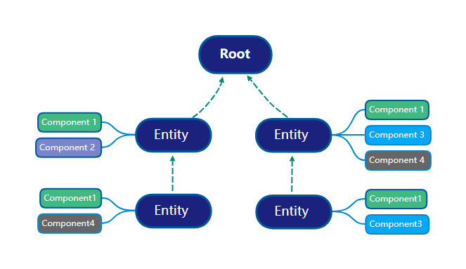

# 实体与组件
借鉴 ECS，组合大于继承（类似于 Go）

## 实体 - Entity
Entity 是组件的容器，用于连接各个组件。它没有实际的功能，如果不添加任何组件，它不会进行任何渲染和功能的表达。 在实际使用中，我们不会直接操作 Entity，一般使用 Object3D 和 Scene3D 作为场景容器节点来连接各个组件。`Entity 只是一个实体类，Object3D 和 Scene3D 才是实体对象。`

## 组件 - Compnent
Component 是一系列可重复利用的模块或数据，Entity 的所有功能都要通过加载 Component 来实现。通过定义组件的逻辑回调和生命周期，我们可以将不同的组件进行自由组合，让 Entity 具备不同的功能，比如：

- 相机 = Position + Rotation + Camera3D
- 灯泡 = Position + Rotation + PointLight + Shadow
- 盒子 = Position + Rotation + Scale + BoxGeometry + Material

其中，所有组件都是独立且平等的，且各自只负责一个单独的功能，这样的拆分使得 Position 和 Rotation 模块可以重复利用，在使用时按需要组合即可，大大提高代码的利用效率，也能有效降低各个模块间的耦合性。

## 内置组件
比如，`Object3D` 已经内置了 `Transform` 组件，已经包含了 `Position`, `Rotation`, `Scale` 等相关功能，方便用户去操作 `Object3D` 的空间变换。`Entity 实体会自带会多组件`