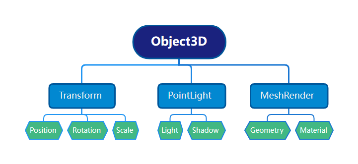

# Object3D

`Object3D 是引擎内置的实体对象，通常被当做基本的组件容器，可以通过不同组件组合来实现不同的功能。`



## 节点状态
初始化一个 Object3D 对象之后，默认处于显示状态，通过设置 transform.enable 的属性变更节点的状态，如果设置为 false，这将停用该节点对象以及该节点下所有的子节点对象，同时附加在这些节点之上的所有组件也将停止调用。
```ts
let obj = new Object3D();
obj.transform.enable = false; //隐藏节点及其所有子节点
```

## 节点(Object3D)的添加和移除
添加一个子节点，可以使用 `addChild` 方法
移除一个子节点，可以使用 `removeChild` 方法
移除特定位置子节点，可以使用 `removeChildByIndex` 方法
从父级移除自己，可以使用 `removeFromParent` 方法
移除所有子节点，可以使用 `removeAllChild` 方法

## 添加和移除组件
通过 `Object3D` 自带的 `addComponent` 和 `removeComponent` 方法，可以方便的在运行时添加和移除组件。

## 获取组件节点
所有的组件都是继承于 `ComponentBase`，在组件内部可以通过 `this.object3D` 属性获得当前组件所属的节点。

```ts
// 自定义一个组件，效果是把节点的X轴位置增加10
class CustomComponent extends ComponentBase {
    public start() {
        this.object3D.x += 10;
    } 
}
```