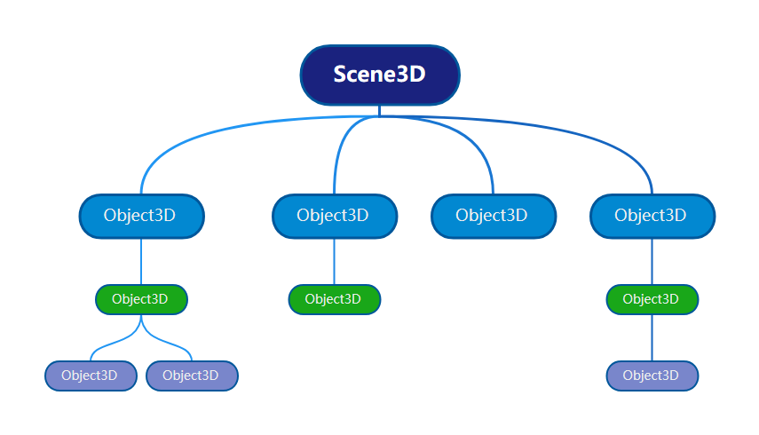

# Scene3D

`Scene3D` 继承自 `Object3D`，拥有 `Object3D` 相同的属性和方法，不同的是 `Scene3D` 是引擎渲染根节点，是场景树的最高层级，所有想要被渲染的节点必须添加到 `Scene3D` 或 Scene3D 的子节点中。

Scene3D 主要功能：

- Scene3D 中定义了场景的天空盒和环境光贴图。
- Scene3D 可以用来控制和管理场景树中的节点，例如：添加、删除、查找节点。

